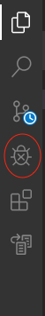
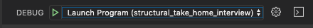
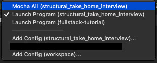

# Graphql-Typescript-Work-index-server

This a graphql server written typescript. This program allows a user to query for people, departments and the relationships between the two entities. 


[](https://travis-ci.org/cjoshmartin/Graphql-Typescript-Work-index-server)
[](https://github.com/semantic-release/semantic-release)

## Getting Started 

### Install Dependencies

```
npm i
```

### Running Server 

``` 
npm start
```

## Developing More Code

### Running test

Test are located here: `src/test/`. Test can be run from vscode or using npm. VScode allows to insert breakpoint anywhere in the test. So it is recommended to be used.

#### VSCode (Recommended)

The is project has a file `.vscode/launch.json` this contains the configurations for running the debugger in VSCode. 

Click the  debugger icon to the right side of the screen.



Click the configuation dropdown



 Select `Mocha All` to run all the test.




Finally, click the play button to run all the test.


#### NPM

To run all test:

```
npm run test
```

To run a single test file (it is necessary to supply an absolute path):

``` 
npm run test-single [absolute path to test file]
```

## Building and Running Code

#### VScode

Click the  debugger icon to the right side of the screen.


Click the configuation dropdown


 Select `Launch Program` to run all the test.


#### NPM 

To complie typesscript to javascript as you code:
```
npm run tswatch
```

Refresh GraphQL playground as code changes: 

```
npm run startwatch
```

Just compile code:
```
npm run ts
```

## Changelog

if you want to grab a download or read through the changelog [click here](https://github.com/cjoshmartin/Graphql-Typescript-Work-index-server/releases)